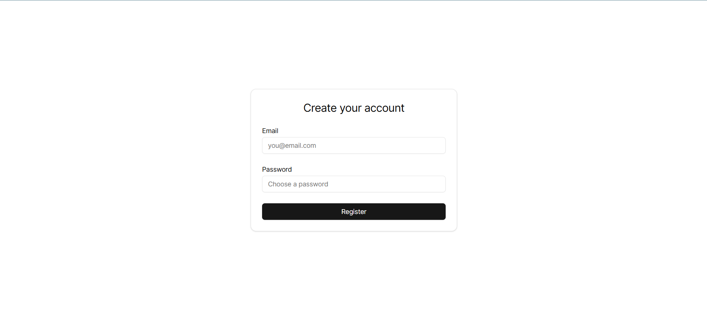
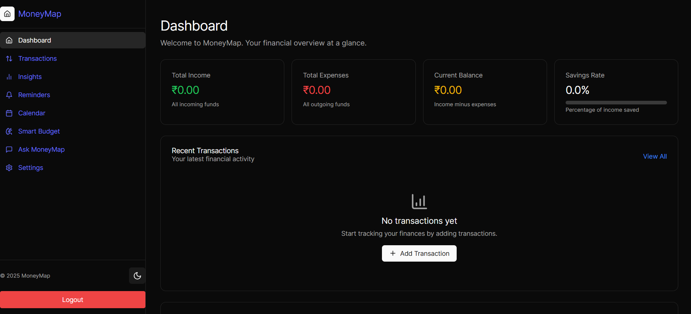

# Personal Finance Manager

A comprehensive personal finance management application built with React, TypeScript, Node.js, and MongoDB.

## 🖼️ Sample Screenshots




*Above: Register and Dashboard views of the Personal Finance Manager app.*

## 🚀 Features

- **Transaction Management**: Track income and expenses with categories
- **Budget Planning**: Set and monitor monthly budgets
- **Smart Insights**: AI-powered financial insights and recommendations
- **Calendar View**: Visualize financial activities over time
- **Reminders**: Set up bill reminders and recurring payments
- **Data Export**: Export your financial data in various formats
- **Responsive Design**: Works on desktop and mobile devices

## 🛠️ Tech Stack

### Frontend
- React 18 with TypeScript
- Vite for build tooling
- Tailwind CSS for styling
- Shadcn/ui components
- React Router for navigation
- Date-fns for date manipulation

### Backend
- Node.js with Express
- MongoDB with Mongoose
- JWT for authentication
- bcrypt for password hashing
- CORS enabled

## 📋 Prerequisites

- Node.js (v16 or higher)
- MongoDB (local or Atlas)
- npm or yarn

## 🗄️ MongoDB Configuration

This app requires a MongoDB database. You have two options:

### Option 1: Local MongoDB

1. [Download MongoDB Community Server](https://www.mongodb.com/try/download/community) and install it.
2. Start MongoDB on your computer (default URL: `mongodb://localhost:27017`).
3. Use the following in your `.env` file:
   ```
   MONGO_URI=mongodb://localhost:27017/your_database_name
   ```

### Option 2: MongoDB Atlas (Cloud, Free)

1. Go to [MongoDB Atlas](https://www.mongodb.com/cloud/atlas/register) and create a free account.
2. Create a new cluster (use the free tier).
3. Add a database user and password.
4. Get your connection string (something like `mongodb+srv://<user>:<password>@cluster0.mongodb.net/your_db?retryWrites=true&w=majority`).
5. Use this in your `.env` file:
   ```
   MONGO_URI=your_connection_string_here
   ```

*If you're new to MongoDB, [this guide](https://www.mongodb.com/docs/manual/introduction/) can help you get started.*

## 🔧 Installation

1. **Clone the repository**
   ```bash
   git clone <your-repo-url>
   cd project
   ```

2. **Install dependencies**
   ```bash
   # Install frontend dependencies
   npm install
   
   # Install backend dependencies
   cd backend
   npm install
   cd ..
   ```

3. **Environment Setup**
   
   Create a `.env` file in the backend directory:
   ```env
   MONGO_URI=mongodb://localhost:27017/your_database_name
   PORT=5000
   JWT_SECRET=your_secure_jwt_secret_here
   ```
   
   Create a `.env` file in the root directory for frontend:
   ```env
   VITE_API_URL=http://localhost:5000
   ```

4. **Start the development servers**
   ```bash
   # Start backend server
   cd backend
   npm start
   
   # In a new terminal, start frontend
   npm run dev
   ```

5. **Access the application**
   - Frontend: http://localhost:5173
   - Backend API: http://localhost:5000

## 🔒 Security Features

### ✅ Implemented Security Measures

1. **Environment Variables**: All sensitive data is stored in `.env` files
2. **JWT Authentication**: Secure token-based authentication
3. **Password Hashing**: Passwords are hashed using bcrypt
4. **CORS Protection**: Cross-origin requests are properly configured
5. **Input Validation**: Server-side validation for all inputs
6. **No Hardcoded Credentials**: All URLs and secrets use environment variables

### 🛡️ Security Checklist

- [x] `.env` files are in `.gitignore`
- [x] No hardcoded localhost URLs in production code
- [x] Sensitive console logs removed
- [x] API endpoints protected with authentication
- [x] Input sanitization implemented
- [x] CORS properly configured

## 📁 Project Structure

```
project/
├── src/                    # Frontend source code
│   ├── components/         # React components
│   ├── pages/             # Page components
│   ├── context/           # React context
│   ├── hooks/             # Custom hooks
│   ├── lib/               # Utility functions
│   └── types/             # TypeScript type definitions
├── backend/               # Backend source code
│   ├── models/            # MongoDB models
│   ├── routes/            # API routes
│   ├── middleware/        # Express middleware
│   └── server.js          # Main server file
├── .env.example           # Environment variables template
├── .gitignore            # Git ignore rules
└── README.md             # This file
```

## 🚀 Deployment

### Frontend Deployment (Vercel/Netlify)

1. Set environment variable:
   ```
   VITE_API_URL=https://your-backend-url.com
   ```

2. Build and deploy:
   ```bash
   npm run build
   ```

### Backend Deployment (Heroku/Railway)

1. Set environment variables:
   ```
   MONGO_URI=your_mongodb_atlas_connection_string
   JWT_SECRET=your_secure_jwt_secret
   PORT=5000
   ```

2. Deploy your backend code

## 🔧 Development

### Available Scripts

**Frontend:**
- `npm run dev` - Start development server
- `npm run build` - Build for production
- `npm run preview` - Preview production build

**Backend:**
- `npm start` - Start production server
- `npm run dev` - Start development server with nodemon

### Code Style

- ESLint configuration included
- Prettier formatting
- TypeScript strict mode enabled

## 🤝 Contributing

1. Fork the repository
2. Create a feature branch
3. Make your changes
4. Test thoroughly
5. Submit a pull request

## 📝 License

This project is licensed under the MIT License.  
Copyright (c) 2025 Rakshankhan Kulkarni

## ⚠️ Important Security Notes

1. **Never commit `.env` files** - They contain sensitive information
2. **Use strong JWT secrets** - Generate a secure random string
3. **Keep dependencies updated** - Regularly update packages for security patches
4. **Use HTTPS in production** - Always use secure connections
5. **Monitor your logs** - Check for suspicious activity

## 🆘 Support

If you encounter any issues or have questions, please open an issue on GitHub.

---

**Note**: This is a personal finance application. Always ensure your data is backed up and stored securely. 
